 

## Sobre mim

Trabalho com desenvolvimento de software na Mandacaru Energia e, no mestrado, com pesquisa operacional. Estou a frente da equipe de desenvolvimento, tocando projetos como o Mandacaru Hub e atuanado em áreas de banco de dados, backend, frontend, infra e liderança de equipe.

No mestrado eu tô dando continuidade a uma pesquisa que comecei ainda na graduação em otimização de carteira de investimento.

No back-end uso Java e Spring, organizado em camadas por feature e casos de uso, com autenticação via JWT e utilização de RBAC hierárquico além disso quando necessário também utilizo auditoria (everns) e observabilidade,. No front-end é React, normalmente em arquitetura hexagonal, e ultimamente venho testando Feature-Sliced Design (FSD) pra organizar por fatia de funcionalidade em vez de por camada. Na pesquisa operacional gosto de implementar os algoritmos do zero em vez de só utilizar algumas biblioteca, inclusive com contribuições em código aberto, como no [CUSTOMHyS](https://github.com/jcrvz/customhys).
 

## Tecnologias e ferramentas

**Back-End**

**Front-End**

**Mobile**

**DevOps & Infraestrutura**

**Pesquisa Operacional & Análise**

 

## Alguns projetos que me representam

| Projeto | Descrição |
|---|---|
| **Mandacaru Hub** *(privado)* | Sistema operacional central de uma empresa de petrólio, do zero à produção multi-filial: inventário, manutenção, treinamentos e e-learning próprio e em constante expansão.
| **[DraeWiki](https://github.com/J0NGS/DraeWiki)** | API de Wiki/base de dados de um universo fictício de futebol. 
| **[MLO](https://github.com/J0NGS/MLO)** | Motor de Branch-and-Bound / Branch-and-Cut implementado do zero em Python, aplicado a 10 problemas clássicos de Pesquisa Operacional. |
| **[cplex_knapsack](https://github.com/J0NGS/cplex_knapsack)** | Resolução do Problema das Múltiplas Mochilas via IBM CPLEX, com benchmark e análise crítica dos resultados. |
| **[AnalisadorLEx](https://github.com/J0NGS/AnalisadorLEx)** | Analisador léxico e sintático (JFlex + JavaCup) para uma linguagem de ontologias no estilo Manchester OWL. |
| **[Cars-Store-ProgDistribuida-Ufersa](https://github.com/J0NGS/Cars-Store-ProgDistribuida-Ufersa)** | Loja de carros via cli em microsserviços usando Java puro com RMI: gateway, servidores de descoberta e serviços separados de carros e usuários. |
| **[CUSTOMHyS](https://github.com/jcrvz/customhys)** *(contribuição)* | Framework de hyper-heurísticas pra otimização contínua. [Contribuí](https://github.com/jcrvz/customhys/commit/98e24bf97951944f10129a714a9628d24aebcc5) com o suporte a operadores de inicialização identificados por prefixo, integrados ao loop principal da hyper-heurística. |

 

## Atividade

<picture>
  <source media="(prefers-color-scheme: dark)" srcset="./dist/github-snake-dark.svg" />
  
</picture>

 

## Estatísticas no GitHub

 

## Contato

